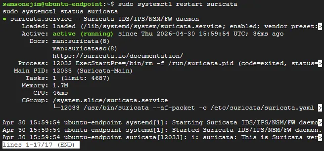
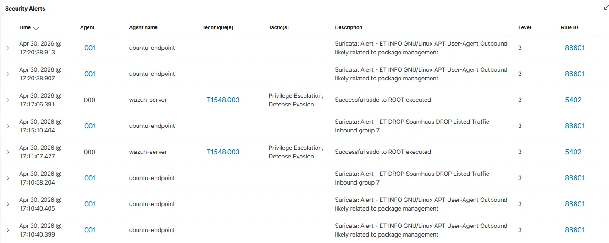
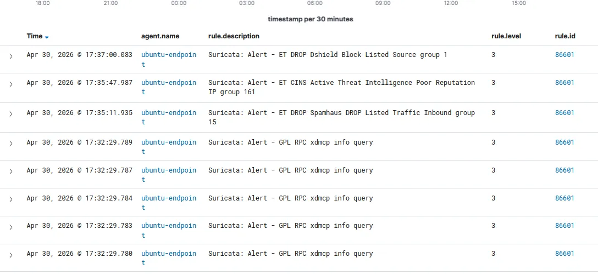
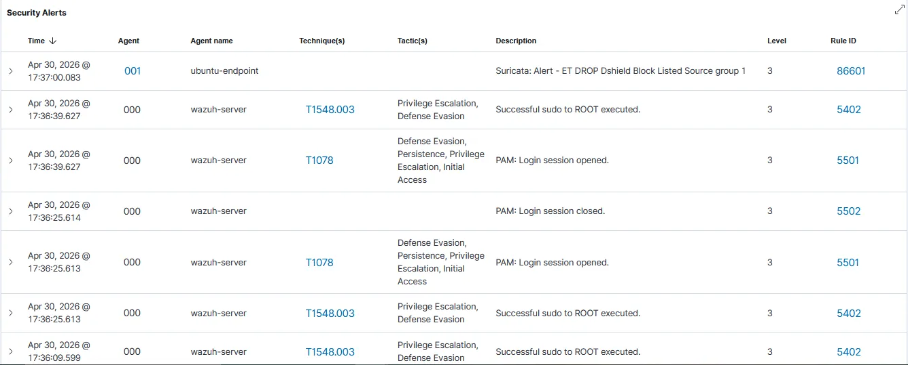
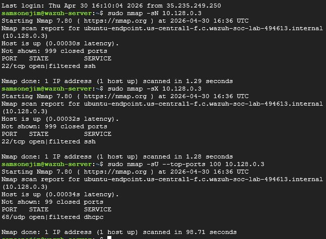
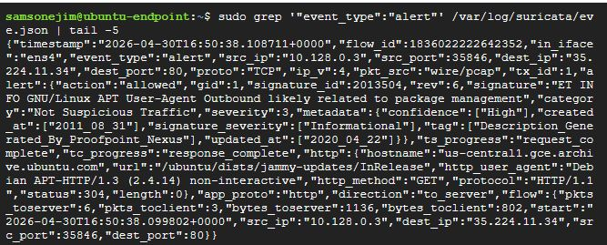

# 🛡️ Suricata IDS + Wazuh Integration: Network Intrusion Detection on GCP


📄 **[Download the Full Step-by-Step Beginner Guide (PDF)](docs/Suricata_IDS_Wazuh_GCP_Guide.pdf)**

---

## 👤 Author

**Samson Ejim**
Cybersecurity Enthusiast | SOC | Threat Detection & Incident Response

---

## 📌 Project Overview

This project extends a previously deployed Wazuh SIEM lab by integrating **Suricata** — an open-source Network Intrusion Detection System (IDS) — to provide **real-time network traffic analysis** on a GCP-hosted Ubuntu server. Suricata inspects every packet entering and leaving the monitored endpoint, matching traffic against 40,000+ community threat signatures. All alerts are forwarded to the **Wazuh dashboard** for centralized SOC monitoring with automatic **MITRE ATT&CK framework mapping**.

### What Makes This Lab Realistic
- Uses **real threat intelligence feeds** (Spamhaus DROP, ET DROP, ET CINS, Dshield) — not simulated threats
- Detects **actual blocklisted IP traffic** hitting the GCP endpoint in real-time
- Maps alerts to **MITRE ATT&CK techniques** automatically (T1078, T1548.003)
- Simulates **real attacker reconnaissance** using Nmap scan techniques

---

## 🏢 Scenario

### Organization Context
A technology company has deployed a Wazuh SIEM for host-based monitoring. Management now requires **network-level visibility** — the ability to detect port scans, exploit attempts, reconnaissance activity, and connections to/from known malicious IP addresses — without purchasing commercial NDR (Network Detection & Response) tooling.

The SOC is tasked with deploying an open-source IDS solution that:
- Monitors all network traffic on the privileged Ubuntu server
- Uses up-to-date community threat intelligence rules
- Forwards all network alerts into the existing Wazuh SIEM
- Maps detections to MITRE ATT&CK for threat context

### Attack Simulation
The lab simulates a threat actor performing reconnaissance against the Ubuntu endpoint:
- **SYN Stealth Scan** (`nmap -sS -p-`) — scans all 65,535 ports
- **Aggressive Scan** (`nmap -A`) — OS fingerprinting, service version detection
- **UDP Scan** (`nmap -sU`) — UDP service discovery
- **NULL Scan** (`nmap -sN`) — stealthy evasion technique
- **XMAS Scan** (`nmap -sX`) — another stealthy evasion technique

---

## 🏗️ Architecture

```
┌──────────────────────────────────────────────────────────┐
│                  Google Cloud Platform (GCP)              │
│                                                          │
│  ┌─────────────────────┐      ┌──────────────────────┐   │
│  │   wazuh-server VM   │      │  ubuntu-endpoint VM  │   │
│  │   (e2-standard-4)   │      │  (e2-medium)         │   │
│  │                     │      │                      │   │
│  │  ┌───────────────┐  │      │  ┌────────────────┐  │   │
│  │  │ Wazuh Manager │◄─┼──────┼──│  Wazuh Agent   │  │   │
│  │  │ Wazuh Indexer │  │TCP   │  │  (v4.7.5)      │  │   │
│  │  │ Dashboard     │  │1514  │  └───────┬────────┘  │   │
│  │  └───────────────┘  │      │          │ reads      │   │
│  │                     │      │  ┌───────▼────────┐  │   │
│  │  ┌───────────────┐  │      │  │ Suricata IDS   │  │   │
│  │  │  Nmap Scanner │──┼──────┼─►│ (v8.0.4)       │  │   │
│  │  │  (attacker)   │  │      │  │ eve.json log   │  │   │
│  │  └───────────────┘  │      │  └───────┬────────┘  │   │
│  └─────────────────────┘      │          │ monitors   │   │
│                               │  ┌───────▼────────┐  │   │
│                               │  │  ens4 (NIC)    │  │   │
│                               │  │  10.128.0.3    │  │   │
│                               │  └────────────────┘  │   │
│                               └──────────────────────┘   │
└──────────────────────────────────────────────────────────┘

Detection Flow:
Network Traffic → Suricata (ens4) → eve.json →
Wazuh Agent → Wazuh Manager → Dashboard Alert
```

---

## 🛠️ Technologies Used

| Tool | Version | Purpose |
|---|---|---|
| **Suricata** | 8.0.4 | Network IDS — traffic inspection & alerting |
| **Wazuh** | 4.7.5 | SIEM — alert collection, correlation, dashboard |
| **Emerging Threats Rules** | Latest | Community threat intelligence signatures |
| **Nmap** | 7.80 | Attack simulation (port scanning, OS fingerprinting) |
| **Google Cloud Platform** | — | Cloud infrastructure |
| **Ubuntu** | 22.04 LTS | OS for both VMs |

---

## ☁️ GCP Infrastructure

This lab reuses the existing Wazuh lab infrastructure — no new VMs required.

| VM | Role | Spec |
|---|---|---|
| `wazuh-server` | Wazuh Manager + Dashboard + Attack simulator | e2-standard-4 |
| `ubuntu-endpoint` | Suricata IDS + Wazuh Agent (monitored host) | e2-medium |

---

## 🚀 Installation & Configuration

### 1. Install Suricata on ubuntu-endpoint

```bash
sudo add-apt-repository ppa:oisf/suricata-stable -y
sudo apt-get update
sudo apt-get install suricata -y
```

Verify installation:
```bash
suricata -V
# This is Suricata version 8.0.4 RELEASE
```

### 2. Configure Suricata

Edit `/etc/suricata/suricata.yaml`:

```bash
sudo nano /etc/suricata/suricata.yaml
```

Key settings changed:

```yaml
# Set specific endpoint IP as protected network
HOME_NET: "[10.128.0.3/32]"

# Monitor all other traffic as potentially hostile
#EXTERNAL_NET: "!$HOME_NET"
EXTERNAL_NET: "any"

# Set correct network interface
af-packet:
  - interface: ens4
```

### 3. Update Suricata Threat Rules

```bash
sudo suricata-update
```

This downloads 40,000+ signatures from the Emerging Threats community ruleset.

### 4. Start Suricata

```bash
sudo systemctl enable suricata
sudo systemctl start suricata
sudo systemctl status suricata
# Active: active (running)
```

### 5. Configure Wazuh Agent to Read Suricata Logs

Edit `/var/ossec/etc/ossec.conf` on **ubuntu-endpoint**:

```xml
<!-- Add before last </ossec_config> tag -->
<localfile>
  <log_format>json</log_format>
  <location>/var/log/suricata/eve.json</location>
</localfile>
```

Restart the agent:
```bash
sudo systemctl restart wazuh-agent
```

### 6. Verify Wazuh Manager Has Suricata Rules

On **wazuh-server**:
```bash
sudo grep -r "Suricata" /var/ossec/ruleset/rules/
# /var/ossec/ruleset/rules/0475-suricata_rules.xml: Suricata rules
# /var/ossec/ruleset/rules/0475-suricata_rules.xml: Suricata Alert
# /var/ossec/ruleset/rules/0475-suricata_rules.xml: Suricata HTTP
# /var/ossec/ruleset/rules/0475-suricata_rules.xml: Suricata DNS
# /var/ossec/ruleset/rules/0475-suricata_rules.xml: Suricata TLS
```

---

## 🧪 Attack Simulation

All scans run from **wazuh-server** targeting **ubuntu-endpoint (10.128.0.3)**:

```bash
# Install Nmap
sudo apt-get install nmap -y

# SYN Stealth Scan — all 65,535 ports
sudo nmap -sS -p- 10.128.0.3

# Aggressive scan — OS fingerprinting + service detection
sudo nmap -A 10.128.0.3

# UDP scan
sudo nmap -sU --top-ports 100 10.128.0.3

# NULL scan — stealthy evasion technique
sudo nmap -sN 10.128.0.3

# XMAS scan — another evasion technique
sudo nmap -sX 10.128.0.3
```

---

## 📊 Alerts Generated

| Rule ID | Alert | Threat Category |
|---|---|---|
| **86601** | ET DROP Dshield Block Listed Source group 1 | Known malicious IP |
| **86601** | ET CINS Active Threat Intelligence Poor Reputation IP group 161 | Threat intel blacklist |
| **86601** | ET DROP Spamhaus DROP Listed Traffic Inbound group 15 | Spam/malware source |
| **86601** | GPL RPC xdmcp info query | Remote desktop reconnaissance |
| **86601** | ET INFO GNU/Linux APT User-Agent Outbound | Package management traffic |
| **5402** | Successful sudo to ROOT executed | Privilege escalation |
| **5501** | PAM: Login session opened | Authentication — MITRE T1078 |

---

## 🎯 MITRE ATT&CK Mapping

Wazuh automatically maps Suricata and system alerts to the MITRE ATT&CK framework:

| Technique ID | Technique Name | Tactic |
|---|---|---|
| **T1046** | Network Service Discovery | Reconnaissance |
| **T1078** | Valid Accounts | Initial Access, Persistence, Privilege Escalation |
| **T1548.003** | Sudo and Sudo Caching | Privilege Escalation, Defense Evasion |

---

## 🔍 SOC Questions — Answered

### 1. How was network intrusion activity detected?
Suricata monitored all traffic on the `ens4` network interface using **af-packet** mode. It matched traffic against 40,000+ Emerging Threats community signatures, logging all matches to `/var/log/suricata/eve.json` in real-time.

### 2. What types of threats were identified?
Three categories of threats were detected: **reputation-based threats** (traffic involving IPs on Spamhaus, Dshield, and CINS blocklists), **reconnaissance activity** (RPC xdmcp queries), and **privilege escalation events** (sudo to root, PAM session activity) mapped to MITRE T1078 and T1548.003.

### 3. How were alerts centralized?
The Wazuh Agent on ubuntu-endpoint was configured to monitor `/var/log/suricata/eve.json` and forward all entries to the Wazuh Manager using the JSON log format. Wazuh's built-in Suricata decoder (`0475-suricata_rules.xml`) parses and categorizes every alert automatically.

### 4. What is the business value of this setup?
This open-source stack delivers **enterprise-grade Network Detection & Response (NDR)** capability at zero licensing cost, providing real-time visibility into network threats with automatic MITRE ATT&CK context — reducing analyst investigation time significantly.

---

## 📁 Repository Structure

```
suricata-ids-wazuh-integration/
├── README.md
├── config/
│   ├── suricata-wazuh-localfile.xml    ← Wazuh agent config for eve.json
│   └── suricata-network-config.yaml    ← Key Suricata settings
├── screenshots/
│   ├── 01-suricata-running.png
│   ├── 02-suricata-alerts-dashboard.png
│   ├── 03-et-drop-cins-alerts.png
│   ├── 04-mitre-attack-mapped.png
│   ├── 05-nmap-scan-results.png
│   └── 06-eve-json-output.png
└── docs/
    └── Suricata_IDS_Wazuh_GCP_Guide.pdf
```

---

## 📸 Screenshots

### Suricata Service Running


### Suricata Alerts on Wazuh Dashboard


### ET DROP & CINS Threat Intelligence Alerts


### MITRE ATT&CK Techniques Mapped


### Nmap Attack Simulation Results


### Suricata eve.json Alert Output


---

## 🔑 Key Takeaways

- Suricata provides **network-level visibility** that host-based tools like Wazuh FIM cannot — catching threats before they touch the filesystem
- **Emerging Threats rules** provide immediate detection capability against 40,000+ known attack patterns with zero manual rule writing
- Integrating Suricata with Wazuh creates a **layered detection stack** — network + host coverage from a single dashboard
- **MITRE ATT&CK automatic mapping** gives SOC analysts instant threat context, reducing time-to-understand from minutes to seconds
- Real blocklisted IP traffic hitting the GCP endpoint proves this is **production-relevant** detection, not just lab simulation

---

## 🔗 Related Projects

| Project | Description |
|---|---|
| [Wazuh + VirusTotal SOC Lab](https://github.com/samsonejim/wazuh-virustotal-soc-lab) | Host-based malware detection with automated response |

---

## ⚠️ Disclaimer

This lab uses Nmap for attack simulation against VMs owned and controlled by the author within a private GCP project. All testing was performed in an isolated lab environment. Never run network scans against systems you do not own or have explicit permission to test.

---

## 📬 Connect With Me

- **LinkedIn:** [linkedin.com/in/samsonejim](https://linkedin.com/in/samsonejim)
- **GitHub:** [github.com/samsonejim](https://github.com/samsonejim)

---

*Built with 🛡️ by Samson Ejim*
